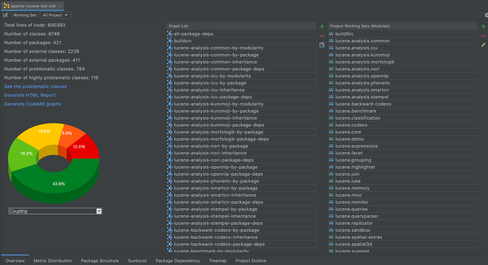
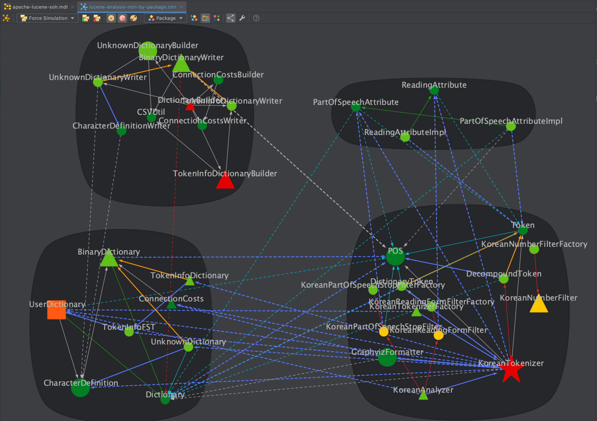
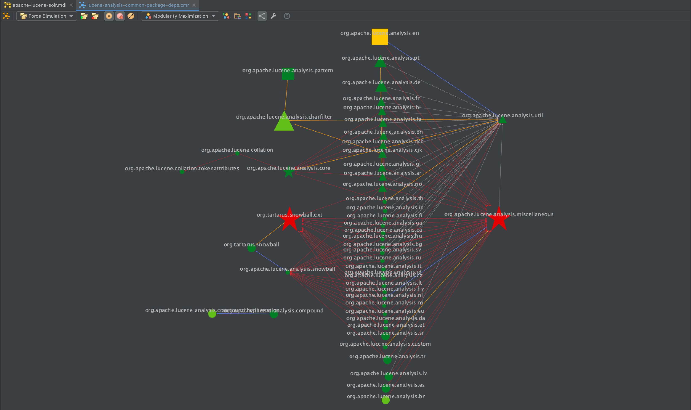

CodeMR Report for Apache Lucene and Solr
=================
You can clone the project and use extracted module and graphs with [CodeMR Eclipse](https://marketplace.eclipse.org/content/codemr-software-quality-tool) or [IntelliJ Plugin](https://plugins.jetbrains.com/plugin/10811-codemr). 

[Report in HTML Format](https://www.codemr.co.uk/case-reports/apache-lucene-solr/html_report_luceneanalysiscommon/htmlx/lbd/dashboard.html)

CodeMR model path: ./codemr/apache-lucene-solr/apache-lucene-solr.mdl

See CodeMR [web site](https://www.codemr.co.uk) for details about the CodeMR Quality Tool.

# General Visualization Styles in Metric Charts ###
In metric charts, software entities like package, class, method are represented in a hierarchical way which reflects their actual encapsulation scheme in code.

Metric charts can also be constructed for different working sets. Working sets represent a more flexible, logical way of grouping software entities. Working sets can be generated automatically by the tool (according to module structure of the project) or they can be defined by the user. Metric charts. The user interface allows you to see metric charts for different working sets.

Color of chart shapes represents metric of corresponding software entity. We categorize each metric into five levels: low, low-medium, medium-high, high, very-high. Because red color is associated with danger in most cultures, red color indicates a high value of selected metric. The heat-map color representation indicates the metric value of entity changes the color scale to a green-to-red spectrum.

(low → high)  

Size of chart shapes proportional to Line of Code metrics of corresponding software entity.

General Visualization Styles in Software Dependency Graphs
In graphs, nodes represents software entities (class, methods) and edges represents the dependencies between the entities.

 
Node color represents the complexity

 
Node shape represents the coupling:

 
Node size represents the actual code size

Assessment of high-level quality attributes can be customized with user interface. Also, color and thickness of edges can be customized according to relation types.  You can select how relations in the source code will be reflected in the graph. You can filter only some relations, also assign different weights and colours to the edges representing those relations. In case there are more than one relation between two classes, all types of relations can be seen from the edge label or the tool tip of the edge. However, for the sake of simplicity, the color of edge is determined by relation type with the highest priority.

#  Supported Metrics

##  Project Metrics
- Project Total Lines of Code
- Number of Packages
- Number of External Packages
- Number of External Entities
- Number of Problematic Classes
- Number of Highly Problematic Classes
## Package Metrics
- Package Total Lines of Code
- Efferent Coupling
- Afferent Coupling
- Number of Interfaces
- Number of Classes
- Number of Entities
- Abstractness
- Instability
- Normalized Distance
## Class Metrics
- Lines of Code
- Weighted Method Count
- Depth of Inheritance Tree
- Number of Children
- Coupling Between Object Classes (CBO)
- Response For a Class (RFC)
- Lack of Cohesion of Methods (LCOM)
- Cohesion Among Methods(CAM)
- Number of Fields
- Number of Methods
- Number of Static Fields
- Number of Static Methods
- Number of Overridden Methods
- Specialization Index
- Access to Foreign Data
- Lack of Tight Class Cohesion
## Method Metrics
- McCabe Cyclomatic Complexity
- Nested Block Depth
- Method Lines of Code
- Number of Parameters
- Number of Methods Called
- Number of Accessed Fields

# Software Quality Attributes
Software external quality displays the visible symptoms when there are issues, but the roots are invisible internal quality attributes: program structure, complexity, coupling, testability, reusability, readability, maintainability. Coupling, Complexity, Cohesion and Size are the fundamental internal quality attributes of a software.

## Complexity
The degree of difficulty in understanding the internal  and external structure of classes and their relationships.. Higher levels of complexity in software increase the risk of unintentionally interfering with interactions and so increases the chance of introducing defects when making changes. When we try to understand the design We should not feel like we are solving puzzle. Code with high complexity is  harder to test, reuse and maintain.

## Coupling
Degree of inter-dependency between software entities

Class A depends on Class B if:
- A has an attribute that refers to (is of type) B.
- A calls on services of an object B.
- A has a method that references B (via return type or parameter).
- A has a local variable which type is class B.
- A is a subclass of (or implements) class B.

Tightly coupled systems tend to exhibit the following characteristics:
- A change in a class usually forces a ripple effect of changes in other classes.
- Require more effort and/or time due to the increased dependency.
- Might be harder to reuse a class because dependent classes must be included.
As a result it reduces maintainability, understandability and reusability

## Cohesion
The degree to which the elements of a module belong together. How they are related to each other.  A class should have one, and only one, reason to change. It is a measurement of how well the methods of a class are related to each other. if software modules are cohesive then it is easy to locate where to change for a given feature. High cohesion (low lack of cohesion) tend to be preferable, because high cohesion is associated with several desirable traits of software including robustness, reliability, reusability, and understandability. In contrast, low cohesion is associated with undesirable traits such as being difficult to maintain, test, reuse, or even understand.

## Size
Size is one of the oldest and most common forms of software measurement. Size is the quantity of some attributes like line of code, number of classes, methods etc. It is generally measured by the number of lines or methods in the code. A very high count might indicate that a class or method is trying to do too much work and should be split up. It might also indicate that the class might be hard to maintain.

High-level quality attributes are calculated from low level code metrics. Assessment of high-level quality attributes can be customized with  CodeMR user interface. 

For more information, please visit https://www.codemr.co.uk

# Snapshots #

#### Overview #### 

#### Lucene Core Module Treemap View ####

#### Lucene Analysis Kuromoji Module Sunburst View ####

#### Lucene Analysis Common Module Inheritance Dependency Graph ####

#### Lucene Analysis Norj Module Dependency Graph Grouped by Package  ####

#### Lucene Analysis Common Module Package Dependency Graph ####

#### Lucene Core Module Package Dependency Chart ####

#### Lucene Core Module Package Structure View ####

#### Lucene Query Parser Module Dependency Graph Grouped by Modularity ####

#### Solr Core Module Inheritance Dependency Graph ####

#### Lucene Suggest Module Dependency Graph Grouped by Package  ####

